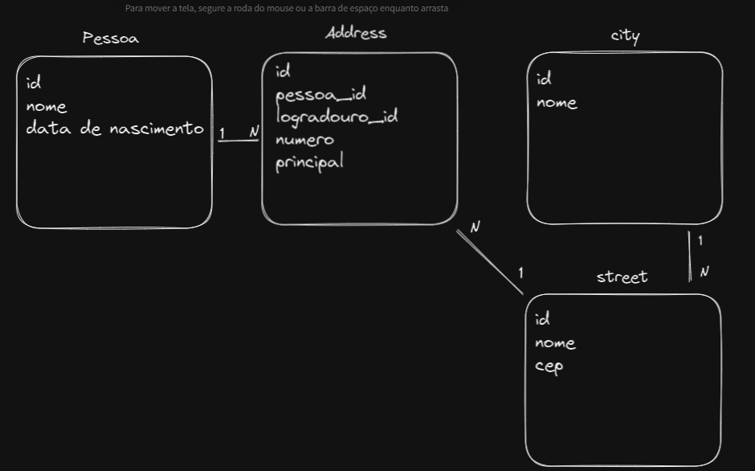

# Contexto

Foi desenvolvido um gerenciador de pessoas e endereços.

## Resposta do teste:

Q= Durante a implementação de uma nova funcionalidade de software solicitada, quais critérios você avalia e implementa para garantia de qualidade de software?

R= Primeiro eu tento entender qual o objetivo da nova funcionalidade e como ela vai funcionar com front, para assim poder desenvolve-la da melhor maneira tanto pro back quanto pro front. E tecnicamente com testes de integração e unitários.

<br>

Q= Em qual etapa da implementação você considera a qualidade de software?

R= Desde do inicio do desenvolvimento do mesmo, normalmente fazendo testes unitários enquanto vou implementando o software. 

<br>

## Técnologias usadas

- Java
- Sprignboot
- Maven
- H2
- JPA
- Tests(Junit5)
- TDD

<br>

## Clonando o projeto

Copie e cole em seu terminal:

```
git clone git@github.com:Arthur-Jr/Attornatus.git && cd Attornatus/
```

<br>

## Todos os comandos abaixo devem ser executados na raiz do projeto!

<br>

## Executando aplicação

<br>
O mvn tem que estar instalado!

```bash
mvn spring-boot:run
```

A aplicação vai estar rodando no link http://localhost:8080/

<br>
<br>

## Executando Tests

<br>

O mvn tem que estar instalado!

```bash
mvn install
```

<br>

## Infos da API:

<br>

Banco de dados associations:


<br>

### Endpoints Payloads:

<br>

POST(/person) - Registra uma nova pessoa.

- name: String
- birthDate: String

---

GET(/person) - Lista todas as pessoa registrada.

---

PUT(/person/personId) - Edita uma pessoa.

- name: String | null
- birthdate: String | null

---

GET(/person/personId) - busca uma pessoa pelo id.

---

POST(/address/personId) - addiciona um novo endereço para a pessoa com o id informado.

- number: int
- principal: bool | null
- city: String
- street: String
- cep: String

---

GET(/address/personId) - Lista todo endereço da pessoa do id informado.

---

GET(/address/addressId) - Busca um endereço pelo id.

---

PUT(/address/addressId) - Muda o endereço principal para o endereço do id informado.
